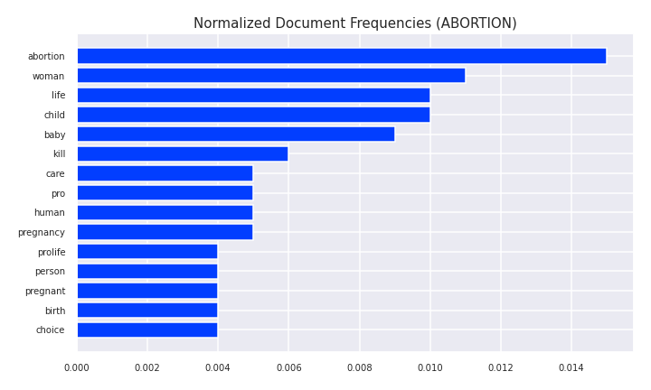
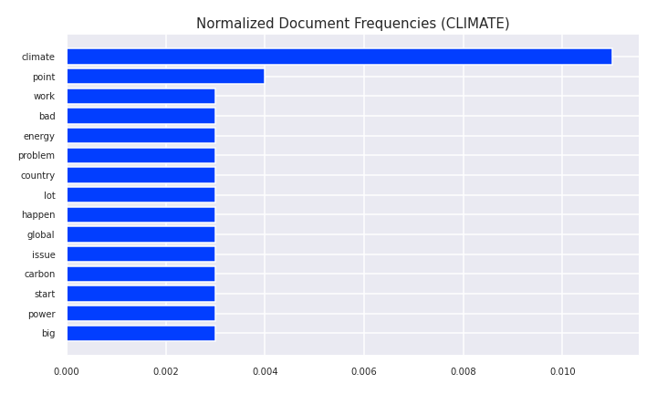
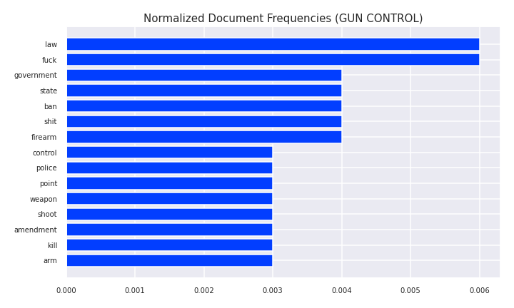
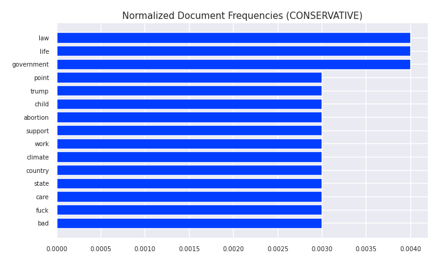

# Utilizing Machine Learning to Predict Political Identity

##### Author: **Suleyman Qayum**


## **Business Understanding**
---

*FP1 Strategies* is a campaign consulting and advertising firm dedicated to helping Republican candidates achieve political success. However, the divide between Liberals and Conservatives has been growing at an alarming rate these last few decades, and this has dramatically affected the American political landscape. Within the Republican and Democratic parties, the number of members with a highly negative view of the opposing party has more than doubled since 1994, while the ideological overlap between the two parties has diminished greatly.

This team at *FP1 Strategies* sees the in **partisanship** as an opportunity. They believe that, because of the factors discussed above, candidates who attempt to placate both sides, trying to be pallatable to everyone, are destined to fail. Those who are willing to take a more direct and authentic approach, who can resonate with the Conservative demographic, can achieve great success. However, the company needs a better way of identifying and reaching out to the Conservative population. Traditional canvassing is slow, cumbersome, and inefficient. In order to improve this, the team at *FP1 Strategies* has come up with an idea called *remote canvassing*. They want to use machine learning to identify a person's ideological preference (i.e. if they are Conservative/Liberal) solely based on their past activity on social media. If the person is determined to be sufficiently conservative, it is assumed they are likely to vote Republican, and the team would reach out to them online, that is, canvass remotely. This is just half the battle, because they also need to know specifically which issues to address when canvassing for potential supporters. Thus, the requirement of being identified as "sufficiently conservative" has to be done with respect to one of the major societal issues that a political candidate can address and garner support for.

*The company wishes to see a demonstration showing that remote canvassing is practically achievable. It should utilize data form social media to answer the following questions:*

> * **Can we use machine learning to accurately determine whether someone takes a Conservative/Liberal stance on an issue?**


## **Data Understanding**
---

### **Background Information**

Collecting data was an involved process. The Conservative and Liberal ideologies are vast, and they play a part in almost every domain of modern life in the United States. Among the numerous issues that parallell the Conservative/Liberal divide, a set of $5$ were chosen. One has to make sure they are polarizing enough to provide meaningful data, yet not too complex or multi-faceted that data collection becomes difficult. These issues were:

* Abortion
* Immigration
* Healthcare
* Gun Control
* Climate Change

Distilling Conservative/Liberal beliefs into a set of cultural issues was necessary because one's stance in regards to each these issues can indeed be quantified with data. The idea is that a person can be identified as Conservative/Liberal by considering the their stance on these contentious topics.

For each of the issues listed above, it is important to define what is meant by a "liberal" viewpoint and a "conservative" viewpoint. The generally accepted definitions of these are summarized in the following sections.

##### **Abortion**
* __Liberal:__ A pregnant woman has a right to abort the fetus because she has autonomy over her body.

* __Conservative:__ A fetus is a human being deserving of legal protection, separate from the will of the mother.

##### **Immigration**

* __Liberal:__ Illegal immigrants deserve rights such as financial aid for college tuition and visas for immediate family members back home.

* __Conservative:__ Government should enforce immigration laws. Those who break the law by entering the United States illegally should not have the same rights as those who obey the law by entering the country legally.

##### **Healthcare**

* __Liberal:__ Support universal health care subsidized by the government. Free healthcare is a basic right that everyone is entitled to.

* __Conservative:__ Free healthcare provided by the government (socialized medicine) means that everyone will get the same poor-quality healthcare. The rich will continue to pay for superior healthcare, while the rest of us receive inadequate healthcare from the government.

##### **Gun Control**

* __Liberal:__ The Second Amendment gives no individual the right to own a gun, but allows the state to keep a militia (National Guard/Armed Forces). Guns are too dangerous.

* __Conservative:__ The Second Amendment gives the individual the right to keep and bear arms. Gun control laws do not thwart criminals. You have a right to defend yourself against criminals. More guns mean less crime.

##### **Climate Change**

* __Liberal:__ Industrial growth harms the environment. Therefore, the U.S. should enact laws to significantly
reduce this, even if it comes at the cost of economic growth.

* __Conservative:__ Changes in global temperatures are natural over long periods of time. Science has not definitively proven humans guilty of permanently changing the Earth's climate.


### **Data Collection**

The data is comprised entirely of posts and comments scraped from the Reddit API. Reddit is a massive collection of forums in which various communities (called Subreddits) post content, discuss ideas, and share news. Reddit was an ideal source of data because there are several communities specifically dedicated to discussing one or more of the above mentioned issues, and which represent both the Liberal and Conservative sides of the debate. Therefore, data was labeled simply according to the Subreddit it belonged to. The process began by manually searching Reddit and curating a group of Subreddits whose community fell under one of the $5$ controversial topics discussed above.

In addition, subreddits pertaining to ideological preference (Conservative/Liberal) and partisanship (Republican/Democrat) were identified and scraped.

It is important to note that two of the Subreddits were used to find posts pertaining to more than one issue. Namely, the `r/AskTrumpSupporters` and `r/Political_Revolution` Subreddits. This could be done because their posts were tagged by sub-topic. (In Reddit language, this is referred to as post *flair*).

The complete list of curated Subredits is shown below:

- **`r/progun`** [Issue(s): **Gun Control** | Stance: **Conservative**]
- **`r/Firearms`** [Issue(s): **Gun Control** | Stance: **Conservative**]
- **`r/gunpolitics`** [Issue(s): **Gun Control** | Stance: **Conservative**]
- **`r/prolife`** [Issue(s): **Abortion** | Stance: **Conservative**]
- **`r/AskTrumpSupporters`** [Issue(s): **Climate Change**, **Immigration**, **Healthcare** | Stance: **Conservative**]
- **`r/climateskeptics`** [Issue(s): **Climate Change** | Stance: **Conservative**]
- **`r/Conservative`** [Issue(s): **Ideology** | Stance: **Conservative**]
- **`r/ConservativesOnly`** [Issue(s): **Ideology** | Stance: **Conservative**]
- **`r/Republican`** [Issue(s): **Partisanship** | Stance: **Conservative**]
- **`r/GunsAreCool`** [Issue(s): **Gun Control** | Stance: **Liberal**]
- **`r/guncontrol`** [Issue(s): **Gun Control** | Stance: **Liberal**]
- **`r/prochoice`** [Issue(s): **Abortion** | Stance: **Liberal**]
- **`r/climate`** [Issue(s): **Climate Change** | Stance: **Liberal**]
- **`r/ClimateOffensive`** [Issue(s): **Climate Change** | Stance: **Liberal**]
- **`r/JoeBiden`** [Issue(s): **Immigration** | Stance: **Liberal**]
- **`r/MedicareForAll`** [Issue(s): **Healthcare** | Stance: **Liberal**]
- **`r/Political_Revolution`** [Issue(s): **Immigration**, **Healthcare** | Stance: **Liberal**]
- **`r/Liberal`** [Issue(s): **Ideology** | Stance: **Liberal**]
- **`r/progressive`** [Issue(s): **Ideology** | Stance: **Liberal**]
- **`r/democrats`** [Issue(s): **Partisanship** | Stance: **Liberal**]


All of the Subreddits above contain anywhere from thousands to tens of thousands of posts. To make the selection process easier, the most popular posts from each Subreddit were collected, along with their comment threads.

Data extracted from the from the Reddit API was stored in the database file: `data/reddit_data.db`. The schema for this database is shown below:

<center></center>


### **Data Description**

#### **Subreddits**

> *The `subreddits` table contains the following columns:*
> * __id__ *[int] - unique identifier of the (name, issue) pair*
> * __name__ *[str] - name of subreddit*
> * __subscribers__ *[int] - number of users subscribed to subreddit*
> * __issue__ *[str] - subreddit topic (`abortion`|`immigration`|`healthcare`|`gun_control`|`climate`|`party`|`ideology`)*
> * __stance__ *[str] - overall stance taken by the subreddit's community (`conservative`|`liberal`)*


#### **Posts**

> *The `posts` table contains the following columns:*
> * __id__ *[str] - unique identifier of the post*
> * __subreddit_id__ *[int] - unique identifier of the parent subreddit*
> * __author_id__ *[int] - unique identifier of the posts's author*
> * __title__ *[int] - title of the post*
> * __score__ *[str] - net number of upvotes the post has received in its lifetime (total number of upvotes - total number of downvotes)*
> * __upvote_ratio__ *[float] - ratio of upvotes to downvotes*
> * __date__ *[int] - date the post was created (Unix time stamp)*

#### **Comments**
> *The `comments` table contains the following columns:*
> * __id__ *[str] - unique identifier of the comment*
> * __subreddit_id__ *[int] - unique identifier of subreddit containing the parent post*
> * __post_id__ *[int] - unique identifier of parent post*
> * __author_id__ *[int] - unique identifier of the posts's author*
> * __body__ *[int] - the comment's main body of text*
> * __score__ *[str] - net number of upvotes the comment has received in its lifetime (total number of upvotes - total number of downvotes)*
> * __date__ *[int] - date the comment was created (Unix time stamp)*

#### **Users**
> *The `users` table contains the following columns:*
> * __id__ *[str] - unique identifier of a Reddit user identified in the `posts`/`comments` table*
> * __subreddit_id__ *[int] - unique identifier of subreddit in which the above Reddit user created a post/comment*

> The `subreddits` and `comments` tables from `data/reddit_data.db` were loaded into memory, and a corpus, made up of individual comments, was created by merging the two `DataFrame` objects.

## **Data Preparation**
---
### **Cleaning the Corpus**

 * Resolving duplicate comments
 * Dropping comments that had already been deleted/removed
 * Removing comments created by bots (automated comments)

### Feature Engineering

As was mentioned previously, the net number of upvotes a comment garnered was given by its entry in the `score` column. In other words, the `score` attribute quantifies how valuable, or meaningful, the parent Subreddit's community finds the comment. Therefore, the `score` can be thought of as a quantitative measure of how well a comment represents with its `issue` and `stance` labels. This is obviously important with respect to the purpose of this analysis, and so the `score` column was used to engineer a new feature, called `quality`.

> The `quality` feature was created to allow the weighting of samples according to how well they represent their corresponding `issue` and `stance` labels.
>
> Assuming all comments with a negative `score` value have been dropped, the `quality` ($Q$) of a comment with `score` $S$ and `lifetime` $\Delta T$ days, was calculated using the following equation:
>
> $$ Q = 1 + \ln (1 + \frac{S}{\Delta T} ) $$

The above equation was formulated, instead of using the raw `score` value, because:
* it accounts for time by taking the time-averaged `score` -- $\frac{S}{\Delta T}$
* squishes the range of values to within a more reasonable range by taking the logarithm of the time-averaged `score` -- $\ln(1 + \frac{S}{\Delta T})$
* given that negative `score` values have been dropped (which is a requirement), ensures the `quality` multiplier is no less than 1 -- $1 + \ln(1 + \frac{S}{\Delta T})$

### Text Normalization

#### **A. Cleaning (Pre-Tokenization)**

Cleaning the textual data was an involved process comprised of several steps:

 * Removing quoted sections
 * Replacing accented characters
 * Removing newline characters
 * Removing web addresses
 * Removing HTML entities
 * Expanding contractions
 * Expanding abbreviated words and phrases

#### **B. Tokenization**

Each comment in the Corpus was sentence-tokenized using the `nltk.sent_tokenize` function (which currently uses the `PunktSentenceTokenizer`). Each of these sentence tokens were then word-tokenized using the `nltk.word_tokenize` function (which currently uses the `TreeBankTokenizer`).

#### **C. POS Tagging & Lemmatization**

POS tagging was carried out on each of the tokenized documents. These documents were then lemmatized by passing their tagged tokens into the `WordNetLemmatizer` from the `nltk` module.

#### **D. Cleaning (Post-Tokenization)**

Further cleaning took place on the tokenized documents:

 * all characters were made lowercase
 * all punctuation was removed
 * any tokens that contained digits were removed
 * tokens comprised of a single character type were removed

#### **E. Stopword Removal**

Stopwords were loaded from the `data/english_stopwords.txt` file and subsequently removed from all tokenized documents. Corpus stopwords were removed as well.

#### **F. Removal of Common Names**

In addition to stopwords, common names were loaded from the `data/common_names.txt` file and removed from all tokenized documents.


### **Exploratory Data Analysis**

Some key statistics were extracted from the Corpus after its documents were normalized.

#### **Label Frequencies**

##### **`ISSUE`**

The plot below shows the frequency of each `issue` label in the dataset:

<center></center>

The above figure indicates that the Corpus was an imbalanced dataset with respect to the `issue` label:

* $~ 35 \%$ of comments were about `GUN CONTROL`
* $~ 23 \%$ of comments were about `ABORTION`
* $~ 21 \%$ of comments were about the `CLIMATE`
* $~ 11 \%$ of comments were about `HEALTHCARE`
* $~ 9 \%$ of comments were about `IMMIGRATION`

Therefore, the sample weights had to be balanced with respect to the `issue` label.

##### **`STANCE`**

The plot below shows the frequency of each `stance` label in the dataset:

<center></center>

The plot above indicates that the Corpus is an imbalanced dataset with respect to the `stance` label as well. It shows there were roughly twice as many comments with a `CONSERVATIVE` stance than comments with a `LIBERAL` stance. Therefore, the sample weights had to be balanced with respect to the `stance` label.

#### **Average Length of Tokenized Document**

The average length of the normalized Corpus was $13.82\ \text{tokens}/\text{document}$, which implies a couple of sentences worth of tokens, on average, made it through the text normalization process. Since there is only an average of $13$-$14$ tokens per normalized comment, collecting $N$-grams larger than bigrams isn't likely to provide much additional benefit. For this reason, unigrams and bigrams were considered during the vectorization process.


#### **Document Frequencies by Label**

Note that the ***document frequency*** of a certain word refers to the number of documents (i.e. comments) in the corpus containing that word.

##### **`ISSUE`**

The plots below list the top $15$ most frequently occurring words for each `issue` label in the Corpus:


<center></center>


<center></center>


<center></center>


<center></center>


<center></center>


The figures above indicate that:

* words such as __`woman`__, __`life`__, and __`child`__ were more prevalent in comments about __`ABORTION`__
* words such as __`energy`__, __`carbon`__, and __`global`__ were more prevalent in comments about the __`CLIMATE`__
* words such as __`ban`__, __`firearm`__, and __`shoot`__ were more prevalent in comments about __`GUN CONTROL`__
* words such as __`insurance`__, __`health`__, and __`medical`__ were more prevalent in comments about __`HEALTHCARE`__
* words such as __`wall`__, __`border`__, and __`illegal`__ were more prevalent in comments about __`IMMIGRATION`__

The observations above indicate there was very little overlap among comments pertaining to different `issue` labels. This indicates that the Subreddits used to scrape comments were chosen well and that the comments in our dataset are representative of their `issue` labels.

##### **`STANCE`**

The plots below list the top $15$ most frequently occurring words for each `stance` label in the Corpus:

<center></center>

<center></center>

The figures above indicate that:

* the words __`child`__, __`life`__, __`work`__, __`point`__, __`state`__, __`country`__, __`bad`__, __`abortion`__, and __`climate`__ are prevalent in both __`CONSERVATIVE`__ and __`LIBERAL`__ comments
* the words __`law`__, __`government`__, __`child`__, and __`care`__ are more prevalent in __`CONSERVATIVE`__ comments
* the words __`women`__, __`pay`__, __`vote`__, __`support`__, and __`help`__ are more prevalent in __`LIBERAL`__ comments

The observations above indicate that, despite the Corpus stopwords being removed during text normalization, there is quite a bit of overlap between `CONSERVATIVE` and `LIBERAL` comments in terms of the most frequently occuring words. This indicates that these two classes are not easily differentiated by syntax alone, and so  comments


### **Extracting the Training, Validation, and Test Sets**

The Corpus was randomly split into a Training, Validation, and Test Set. The Training Set contained $70\%$ of the Corpus samples, while the remaining samples were split evenly between the Validation and Test Sets ($15\%$ each).

### **Vectorization**

The number of features used during the vectorization process was $15,000$. The Training, Validation, and Test Set were vectorized via the `keras.layers.TextVectorization` layer, which was used to perform $2$ types of vectorization: integer encoding and multi-hot encoding with TF-IDF weighting.  Only unigrams were considered during integer encoding and unigrams + bigrams were considered during the multi-hot encoding with TF-IDF weighting.


## **Modeling**
---

### **Scoring**

Since over-representing sentiment (high false positive rate) and under-representing sentiment (high false negative rate) are both equally undesirable, the $F_1\text{-Score}$ was the primary metric by which the models were evaluated. This score takes into account both recall ($R$) and precision ($P$) - if one of these metrics suffers, it will be reflected in the $F_1\text{-Score}$.

The formula for the $F_1\text{-Score}$ is:
> $$ F_1 = 2(\dfrac{1}{R} + \dfrac{1}{P})$$

### **Models**

#### ***`Dense Neural Network (DNN)`***

A series of Dense Neural Networks containing one or more hidden layers, were trained on the Training Set. The inputs to these models were the TF-IDF weighted multi-hot vectors produced by the `keras.layers.TextVectorization` layer. The main parameters being altered were: the architecture (the number and size of hidden layers) and the number/strength of dropout layers.

#### ***`Transformer Encoder Network (TEN)`***

A series of Transformer Encoder Networks were trained on the Training Set. The inputs to these models were the integer-encoded vectors produced by the `keras.layers.TextVectorization` layer. The main parameters being altered were: the architecture (number of heads in the `MultiheadAttention` layer) and the dropout rate within the `TransformerEncoder` layer. The Transformer Encoder Network utilized two custom layers subclassed by the `keras.layers.Layer` base layer class. These were a `TransformerEncoder` containing a `MultiHeadAttention` layer, and `PositionalTokenEmbedding` layer, which took into account token positions in the sequence as they were fed into the model.


### **Results**

The model with the highest $F_1\text{-Score}$ (averaged over the `issue` and `stance` labels) on the Validation Set was chosen as the best model.


A plot of the average $F_1\text{-Score}$ on the Validation Set for `RNN 1`, `RNN 2`, `RNN 3`, `RNN 4`, and `RNN 5` is shown below:

<center></center>

<br>

> The above figure shows that `TEN 4` had the highest average $F_1\text{-Score}$, across all labels, on the Validation Set. Therefore, `TEN 4` was chosen as the best model and evaluated against the Test Set.


## **Evaluation**
---

The `TEN 4` model was evaluated against the Test Set, its performance with respect to the `stance` and `issue` labels is shown in the plots below.

### `STANCE`

<center></center>

<center></center>

The performance of the `TEN 4` model on the Test Set, with respect to the `stance` label, is summarized as follows:

>   - $81\%$ of `CONSERVATIVE` comments were labeled correctly
>   - $19\%$ of `CONSERVATIVE` comments were incorrectly labeled as `LIBERAL`
>   - $48\%$ of `LIBERAL` comments were labeled correctly
>   - $52\%$ of `LIBERAL` comments were incorrectly labeled as `CONSERVATIVE`
---
>   - Overall, the model performed well when identifying `CONSERVATIVE` comments but very poorly when identifying `LIBERAL` comments
> - The model's ability to generalize to unseen data needs alot of improvement:
>   - $10\%$ loss in accuracy indicates the model overfitted to the Training Set

### `ISSUE`

<center></center>

<center></center>

The performance of the `TEN 4` model on the Test Set, with respect to the `issue` label, is summarized as follows:

>   - $77\%$ of all comments related to `ABORTION` were labeled correctly
>   - $70\%$ of all comments related to `CLIMATE` were labeled correctly
>   - $65\%$ of all comments related to `GUN CONTROL` were labeled correctly
>   - $70\%$ of all comments related to `HEALTHCARE` were labeled correctly
>   - $60\%$ of all comments related to `IMMIGRATION` were labeled correctly
---
> - The model performed best when identifying comments about `ABORTION`
> - The model performed worst when identifying comments about `IMMIGRATION`

---
> - Overall, the model performed poorly on all `issue` labels
> - The model's ability to generalize to unseen data needs alot of improvement:
>   - $9\%$ loss in accuracy indicates the model overfitted to the Training Set


## **Limitations and Next Steps**
---

### Imbalance of Data

The data was highly imbalanced, and so some labels were represented far more than others. All models performed noticeably worse when attempting to predict the labels that were not well represented in the dataset. The most noticeable examples of this were the `LIBERAL`, `IMMIGRATION`, and `HEALTHCARE` labels. Since there were less than half as many `LIBERAL` comments as there were `CONSERVATIVE` ones, the performance of every single model suffered when predicting `LIBERAL` comments on the Validation Set. This also occurred for the `HEALTHCARE` and `IMMIGRATION` labels, which comprised of just $11\%$ and $9\%$ of all comments used in the analysis.

### Quantity of Data

Considering there was effectively $10$ different sets of classes, more data was simply needed. In order to remedy this, more comments need to be scraped from the Reddit API. Another way of collecting more data would be to scrape comments from Conservative/Liberal Subreddits and then use unsupervised learning techniques (like clustering) to separate these comments into different topics.

### Selection of Issues

The set of $5$ issues chosen for this analysis were by no means exhaustive. For example, issue related to government spending and the state of the economy were left out. For remote canvassing to work, the model must know how to identify a more comprehensive list of issues than the ones used in this analysis. Thus, a more complete list of issues needs to be defined, and the model built around identifying one or more of these issues in a comment.

### Filtering Out Irrelevant Comments

The greatest limitation of the models developed in this analysis is that they cannot identify irrelevant comments. Thus, one would have to know beforehand whether or not the comments they are feeding to the model are indeed related to one of the politically important issues it knows how to identify. To remedy this, one could implement a system that identifies certain keywords or entities, and filters comments appropriately, before feeding them into the model. Otherwise, resources would be wasted feeding the model irrelevant data.

### Accounting for Moderate Stances

The models are not trained to account for comments that take a moderate stance (i.e. the middle ground between Conservative and Liberal). Moderate Subreddits should be identified such that comments taking a moderate stance on these issues can be collected and incorporated into model development.

## **Further Information**
---

Review the full analysis in the [Jupyter Notebook](./political-identity-analysis.ipynb) or the view the [Presentation](./Political_Identity_Analysis.pdf).

*For any additional questions, please contact:*

> **Suleyman Qayum (sqayum33@gmail.com)**


## **Repository Structure**
---

```
├── data
      ├── common_names.txt
      ├── english_stopwords.txt
      ├── sentiment140.csv
      └── reddit_data.db
├── images
      ├── corpus-statistics
            ├── ABORTION-document-frequencies.png
            ├── CLIMATE-document-frequencies.png
            ├── CONSERVATIVE-document-frequencies.png
            ├── GUN CONTROL-document-frequencies.png
            ├── HEALTHCARE-document-frequencies.png
            ├── IMMIGRATION-document-frequencies.png
            ├── ISSUE-label-frequencies.png
            ├── LIBERAL-document-frequencies.png
            └── STANCE-label-frequencies.png
      ├── ten4
            ├── history.png
            ├── ISSUE-validation-confusion-matrices.png
            ├── ISSUE-validation-metrics.png
            ├── STANCE-validation-confusion-matrices.png
            └── STANCE-validation-metrics.png
      ├── dnn2
            ├── history.png
            ├── ISSUE-validation-confusion-matrices.png
            ├── ISSUE-validation-metrics.png
            ├── STANCE-validation-confusion-matrices.png
            └── STANCE-validation-metrics.png
      ├── dnn3
            ├── history.png
            ├── ISSUE-validation-confusion-matrices.png
            ├── ISSUE-validation-metrics.png
            ├── STANCE-validation-confusion-matrices.png
            └── STANCE-validation-metrics.png
      ├── dnn4
            ├── history.png
            ├── ISSUE-validation-confusion-matrices.png
            ├── ISSUE-validation-metrics.png
            ├── STANCE-validation-confusion-matrices.png
            └── STANCE-validation-metrics.png
      ├── dnn5
            ├── history.png
            ├── ISSUE-validation-confusion-matrices.png
            ├── ISSUE-validation-metrics.png
            ├── STANCE-validation-confusion-matrices.png
            └── STANCE-validation-metrics.png
      ├── ten1
            ├── history.png
            ├── ISSUE-validation-confusion-matrices.png
            ├── ISSUE-validation-metrics.png
            ├── STANCE-validation-confusion-matrices.png
            └── STANCE-validation-metrics.png
      ├── ten2
            ├── history.png
            ├── ISSUE-validation-confusion-matrices.png
            ├── ISSUE-validation-metrics.png
            ├── STANCE-validation-confusion-matrices.png
            └── STANCE-validation-metrics.png
      ├── ten3
            ├── history.png
            ├── ISSUE-validation-confusion-matrices.png
            ├── ISSUE-validation-metrics.png
            ├── STANCE-validation-confusion-matrices.png
            └── STANCE-validation-metrics.png
      ├── ten4
            ├── history.png
            ├── ISSUE-test-confusion-matrices.png
            ├── ISSUE-test-confusion-matrices.svg
            ├── ISSUE-test-metrics.png
            ├── ISSUE-test-metrics.svg
            ├── ISSUE-validation-confusion-matrices.png
            ├── ISSUE-validation-metrics.png
            ├── STANCE-test-confusion-matrices.png
            ├── STANCE-test-confusion-matrices.svg
            ├── STANCE-test-metrics.png
            ├── STANCE-test-metrics.svg
            ├── STANCE-validation-confusion-matrices.png
            └── STANCE-validation-metrics.png
      ├── database-schema.png
      ├── overall-f1-scores.png
      └── overall-f1-scores.svg
├── models
      ├── ten4.h5
      ├── dnn2.h5
      ├── dnn3.h5
      ├── dnn4.h5
      ├── dnn5.h5
      ├── ten1.h5
      ├── ten2.h5
      ├── ten3.h5
      └── ten4.h5
├── classification_utils.py
├── nlp_utils.py
├── nn_utils.py
├── political-identity-analysis.ipynb
├── Political_Identity_Analysis.pdf
├── README.md
├── README.pdf
└── reddit_api_access.py
```
